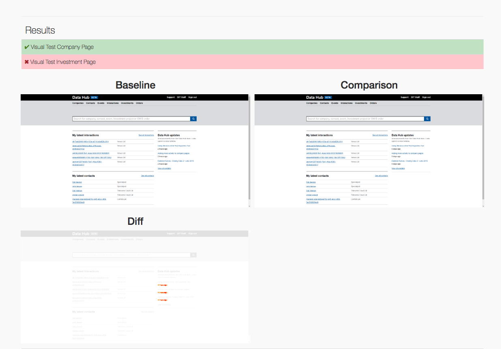

# wdio-image-diff

This wrapper was created to make visual regression as simple as possible, by exposing basic functions that allow you to view the difference between images.
The wrapper uses [pixelmatch](https://github.com/mapbox/pixelmatch) which is simple and powerful and relies on a browser object of [webdriverIO](https://github.com/webdriverio) to take screenshots.

## Build status

[](https://circleci.com/gh/uktrade/wdio-image-diff/tree/master)

## Capabilities

- Compares 2 images
- Saves baseline if no baseline is present
- Creates a diff image in case of failure
- Works with any device/browser supported by wdio and your third party i.e saucelabs
- Force browser window size so it's not reliant on third party (size can be modified via options)
- Take screenshot of the whole page or for a given element

## Integration with webdriverIO

- in `wdio.conf.js` require the package: `const WdioImage = require ('@uktrade/wdio-image-diff-js').default`
- instantiate and expose the `wdioImageDiff` instance to the browser object:
  ```
  exports.config = {
    before: () => {
      const wdioImageDiff = new WdioImage(browser)
      browser.imageDiff = wdioImageDiff
    },
    beforeTest: (test) => {
      browser.imageDiff.testName = `${test.fullTitle} - ${browser.capabilities.browserName}`
    },
  }
  ```

## Dependencies

In order to use `takeElement(elementCssPath)` function you will need to
install imagemagick as we crop the full page screenshot in order to have
an image of a given element.

On Ubuntu

`$ apt-get install imagemagick`

On Mac OS X

`$ brew install imagemagick`

On CentOS

`$ yum install imagemagick`

## Writing a test

- Writing a visual test is composed by 3 steps:
  ```
  const assert = require('assert')

  describe('Visual Test', () => {
    it('should visually check data hub home page is correct', async () => {
      // Navigate to a page (preferably mocked)
      await browser.url('')
      // Take a screenshot of the page (or element, see below)
      await browser.imageDiff.take()
      // Assert images have no pixel differences
      await browser.imageDiff.validate().then(result => {
        assert.equal(result, 0)
      })
    })
  })
  ```

### Notice

Alternatively you can use `takeElement(elementCssPath)` function if you want to
narrow down the area you are testing in the page.

## Options

When instantiating the `WdioImage` you can provide an `options` object i.e:

```
const options = {
  width: 1024,
  height: 768,
  threshold: 0.1
}
const wdioImageDiff = new WdioImage(browser, options)
```

the default values if options or any of its keys is not provided are:
  - width: 1280
  - height: 870
  - threshold: 0.0

## Properties

Available properties used by methods of the class

`testName` # Default value set to 'Undefined test name'

## Reporting

Integration with wdio:

```
exports.config = {
  after: () => {
    browser.imageDiff.generateReport()
  },
}
```

A simple report can be generated after the suite is executed.
Screenshots will only be linked to a test on failures.

The report will look something like:


